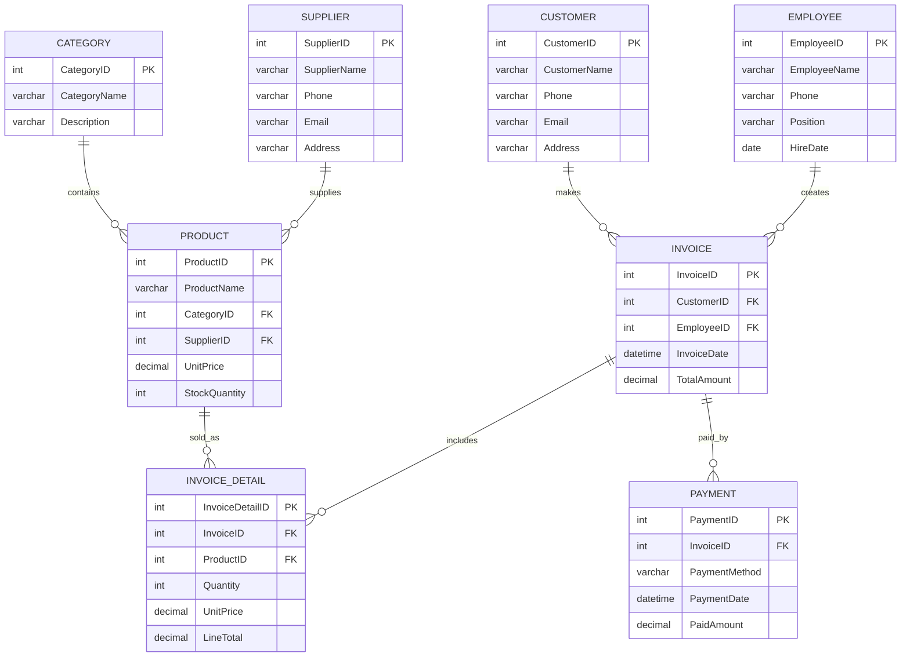

# 02 - Entity Relationship Diagram

## ERD Purpose

The ERD describes the main entities in the Mini Mart Sales Management System and how they are related. It is created based on the business requirements.

## Main Entities

| Entity | Purpose |
| --- | --- |
| Category | Stores product category information. |
| Supplier | Stores supplier details and contact information. |
| Product | Stores product details, price, category, supplier, and stock quantity. |
| Customer | Stores customer details for purchase tracking. |
| Employee | Stores employee details and links employees to invoices they create. |
| Invoice | Stores general sale information such as invoice date, customer, employee, and total amount. |
| InvoiceDetail | Stores each product line in an invoice, including quantity and unit price. |
| Payment | Stores payment method, payment date, paid amount, and related invoice. |

## Relationships

- One category can contain many products.
- One supplier can provide many products.
- One customer can have many invoices.
- One employee can create many invoices.
- One invoice can contain many invoice details.
- One product can appear in many invoice details.
- One invoice can have many payment records.

## Mermaid ER Diagram

The ERD source is available in [`diagram.mmd`](diagram.mmd).

